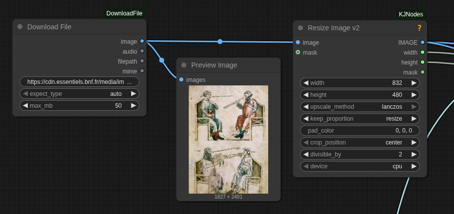

# ComfyUI - Download File

A single ComfyUI node to securely download an image or audio file from a URL, store it in the temp directory, and return it as an `IMAGE`/`AUDIO` tensor plus file path.

## Installation
1. Clone into `ComfyUI/custom_nodes`:
   ```bash
   cd ComfyUI/custom_nodes
   git clone https://github.com/serious-factory/ComfyUI-DownloadFile.git
   ```
2. Install dependencies:
   ```bash
   pip install -r requirements.txt
   ```
3. Restart ComfyUI.

## Quick usage
- Add the **Download File** node (category `Utilities/Download`).
- Provide an HTTP/HTTPS URL to an image (`jpg/png/webp/gif`) or audio file (`mp3/wav/flac/ogg/m4a`).
- Optional: `expect_type` (auto/image/audio) to force the expected type, `max_mb` to cap size (default 50 MB).
- Wire `IMAGE` to image nodes or `AUDIO` to audio nodes. `filepath` points to the downloaded file in ComfyUI temp.



## Built-in safety
- HTTP/HTTPS only, blocks private/loopback hosts to reduce SSRF risk.
- Connection/read timeouts and configurable size limit.
- MIME/extension allowlist for images and audio; unsupported types are rejected.

## Core dependencies
- `requests`, `torch`, `torchaudio`, `pillow`, `numpy` (ComfyUI provides `folder_paths`).
